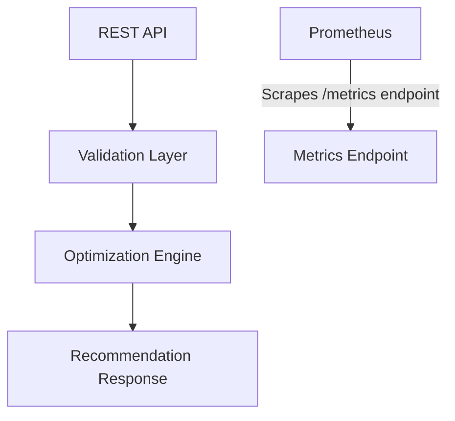

# Kubernetes Resource Optimization Agent

A lightweight Kubernetes workload optimization service built in Go.

This service analyzes workload resource utilization metrics and generates safer CPU and memory recommendations to reduce overprovisioning while avoiding aggressive downsizing.

---

## Features

- REST API-based optimization service
- Kubernetes-style workload analysis
- Safer CPU and memory recommendations
- Configurable optimization buffers
- Prometheus metrics integration
- Dockerized application
- Docker Compose support
- Kubernetes deployment manifests
- Unit tests
- Clean modular project structure

---

## Tech Stack

- Go
- Chi Router
- Prometheus
- Docker
- Docker Compose

---

## Project Structure

```text
k8s-resource-optimizer/
│
├── cmd/
│   └── server/
│       └── main.go
│
├── internal/
│   ├── handlers/
│   ├── optimizer/
│   ├── models/
│   ├── metrics/
│   ├── config/
│   └── utils/
│
├── tests/
├── sample/
├── k8s/
│
├── Dockerfile
├── docker-compose.yml
├── prometheus.yml
└── README.md
```

---

## Architecture



---

## Optimization Strategy

The recommendation engine compares:

- **requested resources**
- **actual average utilization**

The optimizer applies:

- safety buffers
- conservative memory sizing
- resource rounding

to avoid aggressive downsizing.

---

### CPU Strategy

- CPU recommendations are generated using:
  - average CPU usage
  - configurable safety multiplier
  - rounding to nearest 50m
- CPU is treated more aggressively because CPU throttling is generally safer than memory exhaustion.

---

### Memory Strategy

- Memory recommendations are more conservative because:
  - memory is non-compressible
  - underprovisioning can lead to OOMKills
- Memory values are rounded to the nearest 128MB boundary.

---

## Assumptions

This implementation makes the following assumptions:

- Input metrics are representative of workload behavior.
- Average utilization metrics are available.
- Historical percentile data (p95/p99) is not available.
- Recommendations should prioritize safety over aggressive cost reduction.
- CPU and memory requests are provided in millicores and MB respectively.
- Current implementation uses static JSON metrics input instead of live Kubernetes metrics.

---

## API Endpoint

### `POST /optimize`

Analyzes workloads and generates optimization recommendations.

#### **Request**

```json
[
  {
    "deployment": "api-service",
    "cpu_request": 1000,
    "cpu_usage_avg": 180,
    "memory_request": 2048,
    "memory_usage_avg": 700
  }
]
```

#### **Response**

```json
[
  {
    "deployment": "api-service",
    "recommended_cpu": 300,
    "recommended_memory": 1024,
    "reason": "Average usage significantly below requested resources"
  }
]
```

---

## Running Locally

### Prerequisites

- Go 1.24+
- Docker
- Docker Compose

### Run Without Docker

```sh
go run cmd/server/main.go
```

Server will be available at: [http://localhost:8080](http://localhost:8080)

### Run With Docker Compose

```sh
docker compose up --build
```

#### **Services Exposed**

| Service          | URL                        |
|------------------|---------------------------|
| Optimizer API    | http://localhost:8080     |
| Prometheus       | http://localhost:9090     |
| Metrics Endpoint | http://localhost:8080/metrics |

---

## Testing the API

```sh
curl -X POST http://localhost:8080/optimize \
 -H "Content-Type: application/json" \
 -d @sample/input.json
```

---

## Prometheus Integration

The application exposes Prometheus-compatible metrics via:

- `/metrics`

Prometheus scrapes metrics every 5 seconds using the configured scrape job.

### Example Metrics:

- `optimization_requests_total`
- `recommendations_generated_total`
- `optimization_request_duration_seconds`

---

## Kubernetes Deployment

Kubernetes manifests are available under:

- `k8s/`

These manifests demonstrate Kubernetes-native deployment examples for the service.

---

## Sample Input

Located in:

- `sample/input.json`

### **Sample Output**

```json
[
  {
    "deployment": "api-service",
    "recommended_cpu": 300,
    "recommended_memory": 1024,
    "reason": "Average usage significantly below requested resources"
  }
]
```

---

## Unit Tests

Run tests using:

```sh
go test ./...
```

---

## Future Improvements

Possible future extensions include:

- Prometheus query integration
- Kubernetes API integration
- Historical metrics analysis
- Percentile-based recommendations
- HPA/VPA awareness
- Multi-cluster support
- Real-time recommendation streaming
- Recommendation confidence scoring
- Namespace-level optimization policies

---

## Scaling This System In Real Kubernetes Clusters

In production Kubernetes environments, this system could be extended using:

### Kubernetes APIs

Use Kubernetes client-go to:

- fetch deployments
- fetch pod specifications
- inspect resource requests/limits

### Metrics Collection

Use:

- Prometheus
- Metrics Server
- kube-state-metrics

to gather workload utilization metrics.

### Historical Analysis

Instead of average utilization:

- use p95/p99 usage
- detect spikes
- identify burst patterns

### Multi-Cluster Architecture

For large-scale environments:

- centralized recommendation engine
- per-cluster collectors
- asynchronous processing pipelines

### Reliability Considerations

Production systems would require:

- stale metrics handling
- RBAC permissions
- rate limiting
- retry mechanisms
- recommendation approval workflows

---

## Additional Improvements

Implemented improvements beyond minimum requirements:

- Prometheus observability integration
- Docker multi-stage builds
- Docker Compose orchestration
- Kubernetes deployment examples
- Configurable optimization policy
- Modular architecture
- Graceful error handling
